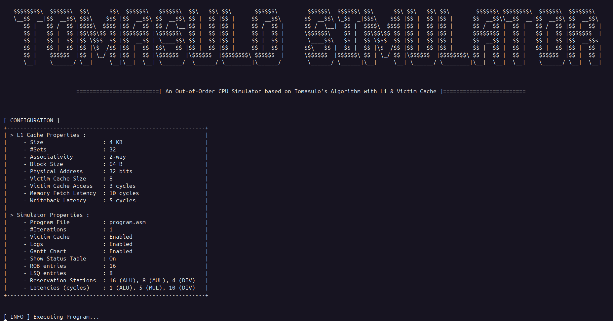
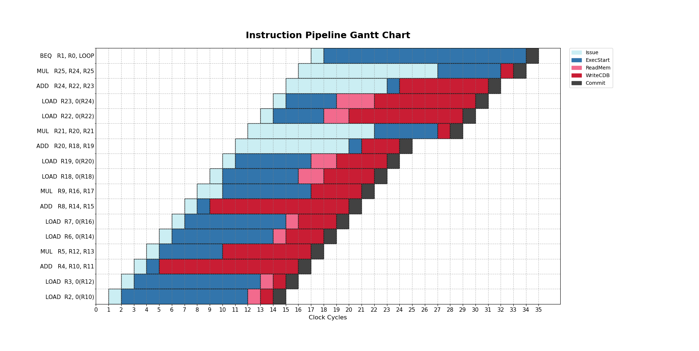
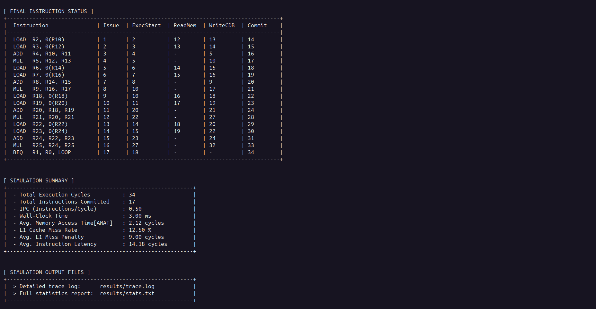
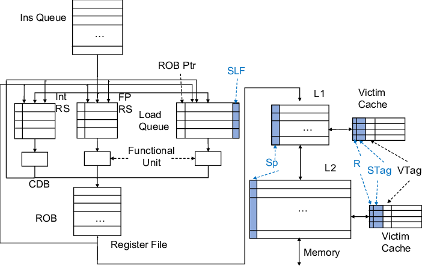
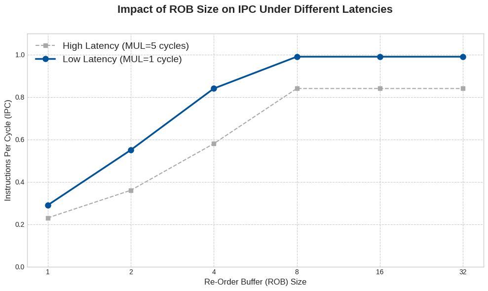
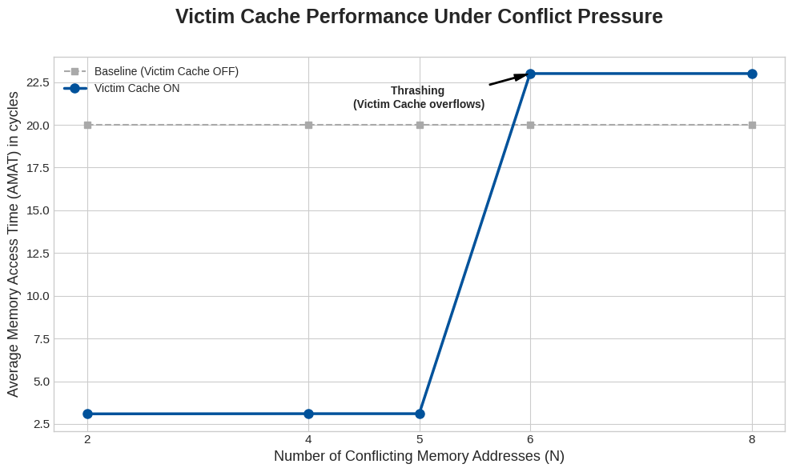
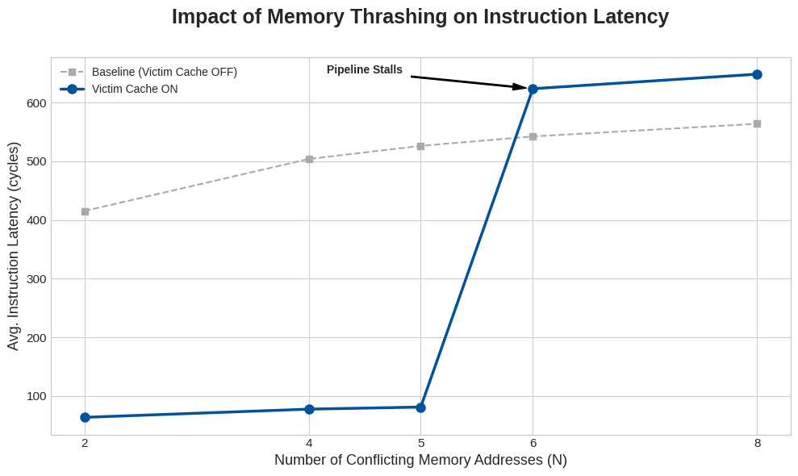
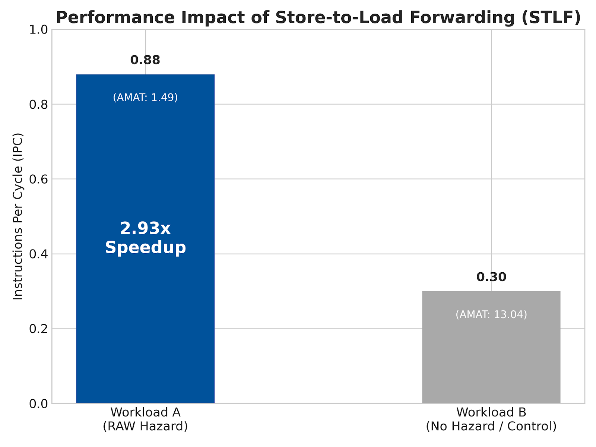

👉  Related project : [Victim Cache Analysis in gem5](https://github.com/Anand-786/gem5-victim-cache)

# Tomasulo Simulator  

An Out-of-Order CPU simulator implementing Tomasulo’s Algorithm with LSQ, ROB, L1 Data Cache, and Victim Cache. Features configurable parameters, cycle-by-cycle tracing, statistics generation, and Gantt chart visualization. Designed for education and computer architecture research.


## Project Showcase  

<p align="center">
  
</p>

<p align="center">
  
  
</p>

## System Architecture

<p align="center">
  
</p>  

<p align="center">
  <i>Source: ReViCe: Reusing Victim Cache to Prevent Speculative Cache Leakage - Scientific Figure on ResearchGate</i>
</p> 
 
## Components and Features  

| Component / Feature         | Config Parameter(s)                           |
|-----------------------------|-----------------------------------------------|
| Reorder Buffer (ROB)        | `rob_size`                                    |
| Load/Store Queue (LSQ)      | `lsq_size`                                    |
| L1 Data Cache               | `num_sets`, `associativity`, `block_size`     |
| Victim Cache                | `victim_cache_size`, `vc_access_latency`      |
| ALU RS                      | `num_alu_rs`, `alu_latency`                   |
| MUL RS                      | `num_mul_rs`, `mul_latency`                   |
| DIV RS                      | `num_div_rs`, `div_latency`                   |
| Memory Subsystem            | `mem_fetch_latency`, `wb_latency`             |
| Program Input               | `program_file_path`                           |
| Cycle-by-Cycle Trace        | `trace_file_enabled`                          |
| Gantt Chart                 | `gantt_chart_enabled`                         |
| Statistics Generation       | (auto-generated)                              |
| Register File               | (fixed)                                       |

---

## Experiments & Results  

I performed 3 main experiments on the Simulator. Here are their objectives, setup, results and key takeaways.

### 1. Impact of ROB Size vs. IPC  

**Objective:**  
To study how the benefit of increasing the Re-Order Buffer (ROB) size changes under workloads with different instruction latencies. 

**Experimental Setup:**  

| Parameter              | Value                         |
|------------------------|-------------------------------|
| MUL Latency            | 1 cycle(low), 5 cycles(high)  |
| Reservation Stations   | 32                            |
| L1-D size              | 32 KB                         |
| #iterations            | 100                           |

<p align="left">
  
</p>

**Key Takeaway:**  
When instruction latencies are high (e.g., long MUL operations), a larger ROB allows more overlap and better latency hiding, leading to clear performance gains. For low-latency instructions, however, the performance improvement saturates quickly, and increasing the ROB further offers little additional benefit.

---

### 2. Victim Cache Effectiveness and Thrashing Point  

**Objective:**  
To evaluate the effectiveness of a Victim Cache (VC) in reducing conflict misses penalties and to identify the point at which it stops being useful. 

**Experimental Setup:**  

| Parameter           | Value                           |
|---------------------|---------------------------------|
| L1 D-Cache          | 4KB, Direct-Mapped, 64B Block   |
| Victim Cache        | 4 Entries                       |
| Mem Access Penalty  | 20 cycles                       |
| VC Hit Penalty      | 3 cycles                        |

<p align="left">
  
  
</p>

**Key Takeaway:**  
The VC substantially reduced the Average Memory Access Time (AMAT) up to the point where the number of conflicting addresses exceeded its capacity (around N=6). Beyond this point, thrashing occurred and the benefit disappeared. This indicates that the VC works well in mitigating conflict misses, but only within the limits of its small storage capacity.

---

### 3. LSQ Effectiveness: Store-to-Load Forwarding  

**Objective:**  
To test whether the Load-Store Queue (LSQ) correctly performs Store-to-Load Forwarding (STLF), using a workload with explicit memory dependencies.

**Experimental Setup:**  

| Parameter       | Value                          |
|-----------------|--------------------------------|
| L1 D-Cache      | 1KB, Direct-Mapped, 32B Block  |
| LSQ Size        | 32 Entries                     |
| Victim Cache    | Disabled                       |
| STLF            | Enabled                        |

<p align="left">
  
</p>

**Key Takeaway:**  
With STLF enabled, dependent loads were able to receive data directly from earlier stores, avoiding cache access delays. This resulted in a 2.93× increase in IPC compared to the baseline workload. The result shows that STLF is not just a correctness feature but also an important optimization for workloads with memory-based dependencies.  

## Example Output (Statistics Snapshot)  
```txt
Cycle 120:
  - Instruction: MUL R1, R2, R3 issued
  - ROB Status: ...
  - Cache Access: Miss in L1, Hit in Victim
